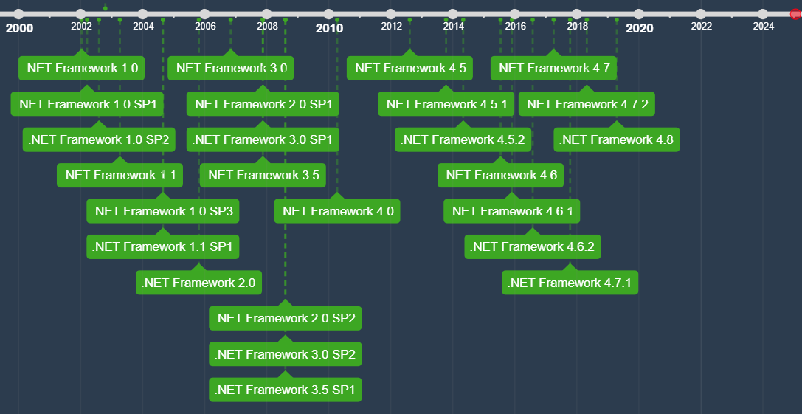

<!-- .slide: class="transition-bg-sfeir-2" -->

# .NET Framework

##==##

# Avant le dotnet framework

Dans les **années 90**, Microsoft utilise et propose:

- **Win32** API
- **COM** (Component Object Model)
- **C++** avec MFC (Microsoft Foundation Classes)
- **Visual Basic** qui permettait du développement avec une interface graphique
- **ASP** (Active Server Page), pour des pages web dynamiques côté serveur

##==##

# Contexte

- Sortie de **Java** en 1995 (7 ans avant dotnet)
- Plateforme **J2EE** de Sun, pour créer des applications côté serveur.

##==##

# Timeline

[https://time.graphics/line/**291016**](https://time.graphics/line/291016)


##==##

<!-- .slide: class="two-column" -->

## .Net Framework 1.0 (2002)

- C#
- Sites web avec **ASP.NET**
- On peut se connecter à des bases de données grâce à **ODBC** (=interface en C qui permet d’accéder à différentes bases de données)
- Sortie de **mono**
<!-- .element: class="list-fragment" -->

##--##

<!-- .slide: class="text-dark" data-background="#2c3c4e" -->


##==##

<!-- .slide: class="two-column" -->

## .Net Framework 2.0 (2005)

- **Micro dotnet** première initiative pour des objets connectés <small>(lié au projet SPOT = Smart Personal Object Technology)</small>
- Ajout des **Generics**. Permet de prendre en paramètre un type sur lequel les méthodes et propriétés de la classe vont s’appliquer.

```csharp
class List<T> where T : object
{
    Add(T item);
    Remove(T item);
    //...
}
```

<!-- .element: class="list-fragment" -->

##--##

<!-- .slide: class="text-dark" data-background="#2c3c4e" -->


##==##

<!-- .slide: class="two-column" -->

## .Net Framework 3.0 (2006)

- **WinForms**, pour des applications “lourdes/desktop”
- **WCF**, messages `SOAP` ancêtre des services web
- **WPF**, basé sur le dessin vectoriel et le langage `xaml`
<!-- .element: class="list-fragment" -->

##--##

<!-- .slide: class="text-dark" data-background="#2c3c4e" -->


##==##

<!-- .slide: class="two-column" -->

## .Net Framework 3.5 (2007)

- **LINQ** ajoute de nombreuses méthodes et nécessite que les collections (xml, sql) soient dans des objets

```csharp
// Query syntax
var query = from e in experts
            where e.City == "Strasbourg"
            select e;
```

ou

```csharp
// Extension methods
var query = experts.Where(e => e.City == "Strasbourg");
```

- **Entity Framework**, permet de faire le mapping entre sql et objet. On parle d’ORM (objet-relationnal-mapping)
<!-- .element: class="list-fragment" -->

##--##

<!-- .slide: class="text-dark" data-background="#2c3c4e" -->


##==##

<!-- .slide: class="two-column" -->

## .Net Framework 3.5 SP1 (2008)

- ASP.NET **MVC**

##--##

<!-- .slide: class="text-dark" data-background="#2c3c4e" -->


##==##

<!-- .slide: class="two-column" -->

## .Net Framework 4.0 (2010)

- **TPL** (=Task Parallel Library)
  - Parallel LINQ
  - Concurrent Collections
  - Semaphores, Mutex, Monitor (lock)

```csharp
var experts = new List<Expert>();

Parallel.ForEach(experts, e => Process(e));
```

```csharp
// Only one thread can enter this block
lock (this)
{
    //...
}
```

##--##

<!-- .slide: class="text-dark" data-background="#2c3c4e" -->


##==##

<!-- .slide: class="two-column" -->

## .Net Framework 4.5 (2012)

- Support pour les interfaces tactiles (UWP)
- **async/await** tasks pour de la programmation asynchrone et non bloquante

```csharp
public async Task<List<Expert>> GetExperts()
{
    await httpClient.GetAsync("myapi.com/experts");
    //...
}
```

##--##

<!-- .slide: class="text-dark" data-background="#2c3c4e" -->


##==##

<!-- .slide: class="two-column" -->

## .Net Framework 4.6.2 (2016)

- Apparition de **dotnet core**

##--##

<!-- .slide: class="text-dark" data-background="#2c3c4e" -->


##==##

# .NET Framework : Details

Pour plus de détails sur les versions et leurs dépendances:
[https://learn.microsoft.com/en-us/dotnet/framework/migration-guide/**versions-and-dependencies**](https://learn.microsoft.com/en-us/dotnet/framework/migration-guide/versions-and-dependencies)
